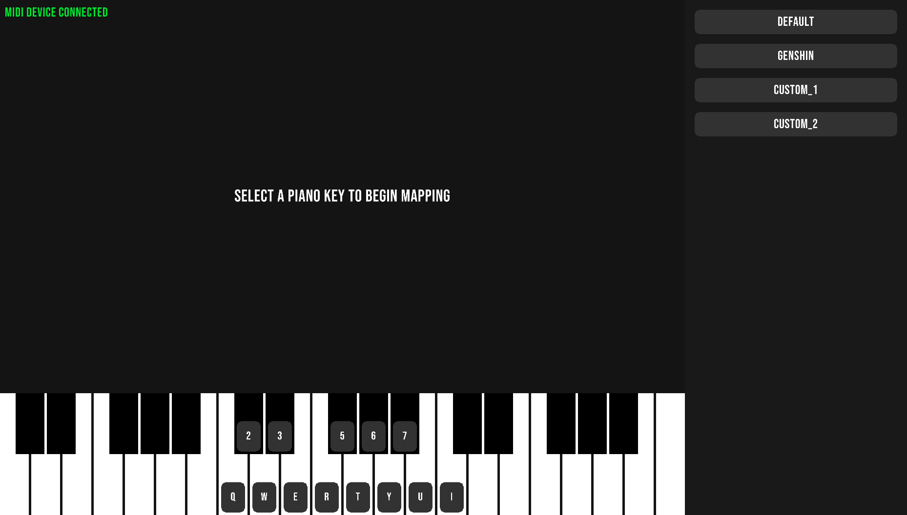

# Maidai

Better alternative for a MIDI translator, simple program that allows you to use your MIDI controller as a keyboard. This was made so that it's more convenient to play [bard's](https://ffxiv.consolegameswiki.com/wiki/Bard) instruments in [FFXIV](https://www.finalfantasyxiv.com/), because adding support for a MIDI controller in a 20+ years old game is too hard.

This project uses a fantastic library [raylib](https://www.raylib.com/) for most (if not all) of the rendering.



## Compile/Build

Make sure to change `MSVC_PATH` in the build script.

```console
> build.bat
```

## Run

```console
> cd build
> maidai.exe
```
